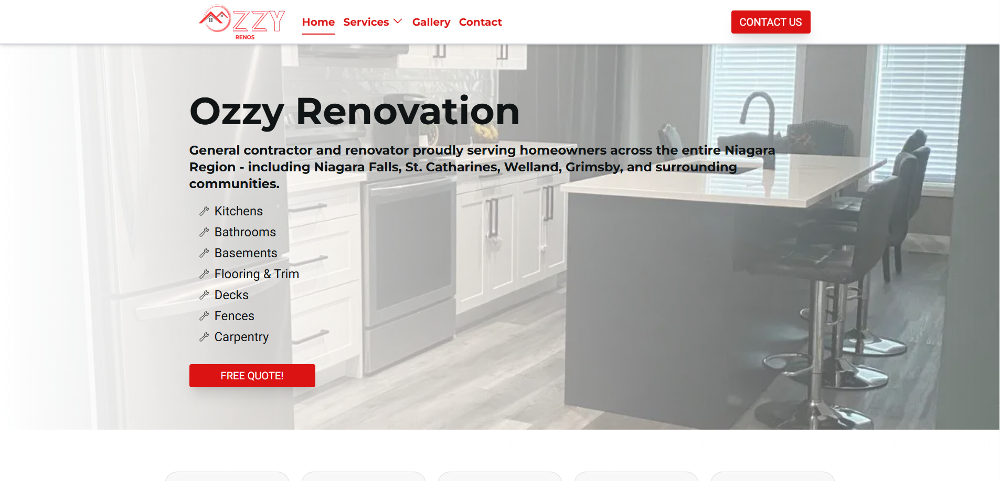
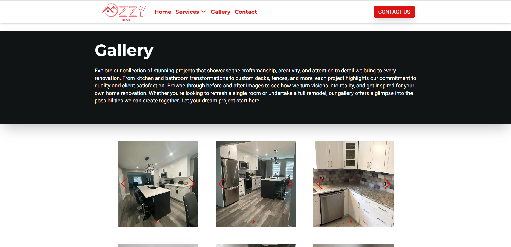
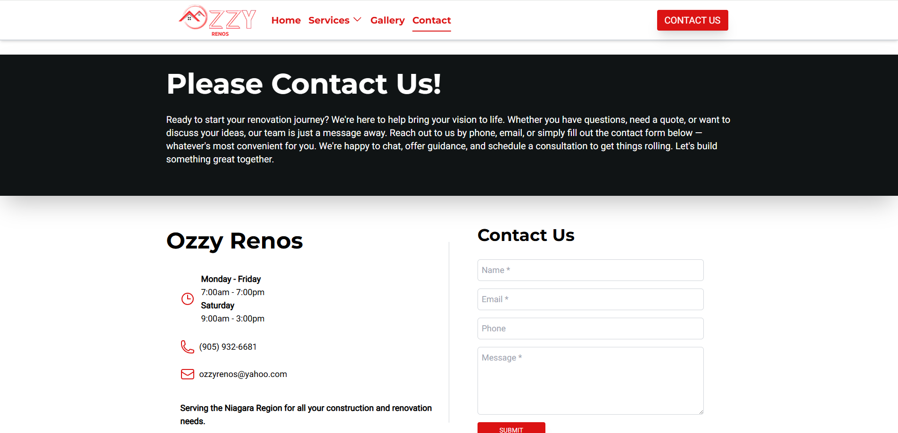

# Ozzy Renovation

Ozzy Renovation is a Niagara-based contractor specializing in home renovations, including kitchens, bathrooms, and flooring. This website is a centralized place for potential clients to see who he is, what services he offers, and view a gallery of photos from his previous work.

## Live Site

https://www.ozzyrenos.ca/

## Project Overview

As a showcase platform for a local contractor, this website gives Ozzy Renovation a digital presence to attract and convert visitors into clients. The owner approached me to build a site that would highlight his services and portfolio to local residents. His primary goal was to establish a professional brand presence through both a website and his Google Business Profile. I was responsible for designing and building the site, assisting with brand presence, and helping establish the company's Google Business Profile and online visibility.

## Tech Stack

- Next.js
- React
- TypeScript
- Tailwind CSS
- Formspree for form handling
- Elfsight widget to display Google Reviews
- Vercel for hosting

## Key Features

- Responsive, mobile-first design
- Optimized Google Lighthouse scores including SEO semantic structure
- Optimized images using Next.js's built-in Image component
- Contact form handled with Formspree to send submissions directly to the client's inbox
- Elfsight to display Google Reviews from prior clients

## Architecture Decisions

- Wanted to expand my tech stack toolkit - Next.js was chosen as it is a popular metaframework for developers who use React
- Separated client components only where interactivity is required to increase performance and SEO
- Header navigation state managed through React component state with callbacks passed to child components
- Responsive design implemented using Tailwind CSS breakpoints to ensure usability across devices

## Folder Structure

- /app for pages and global styles
- /components for reusable UI components
- /public for static assets (images)

## Technical Decisions

Prior familiarity with React and an opportunity to practice my skills with its component-based structure was the primary reasoning for choosing React and Next.js

Wanted to integrate Tailwind CSS for styling into my technological skillset as well as it has become the largest CSS styling library and is extremely versatile.

Vercel was chosen for hosting since it has a free-tier service that is sufficient for the project. Furthermore, its integration with Next.js continuous deployment makes deploying seemless and trivial.

## Challenges and Solutions

My biggest challenge was coordinating with the client and managing all of the technical work. I had limited input on design from him, so there were many demos built but ultimately not pushed to the repository after he selected his favourite from the bunch. I spent significant time building things that never got shipped, but utilized the opportunity to improve my skills.

I had limited exposure to SEO practices and understanding its importance in search algorithms prior to this project. I had reached out to third-party friends who had experience with it before and they aided me in understanding what it was and how to improve scores via tools like Lighthouse.

Additionally, I had never worked with Google Business Profiles before and how to start one. There was a learning curve behind that and setting up advertisements for my client's business. Through research, I helped initialize a business platform for him on Google and added contact info including his contact information such as his phone number and website.

## What I Learned

- Tailwind CSS
- Furthered my understanding of React's component-based development
- Deployment via Vercel and its dashboard
- Google Lighthouse and how to maximize its scores

## Screenshots

### Home Page

### Gallery Page

### Contact Page

